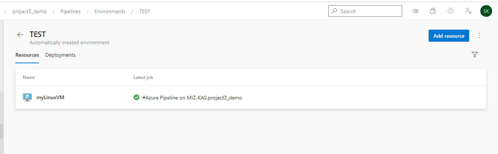

# Ensuring Quality Releases Project
Demonstrating building a CI/CD pipeline with Azure DevOps

## Status
Azure DevOps Badge her

### Table of Contents 
- [Introduction](#introduction)
- [Project Dependencies](#)

### Introduction 

In this project, Azure DevOps is used to build a CI/CD pipeline that create and deploy in infrastructure using terraform, Azure App service to host a website - FakeRestAPI.
The automated test runs on a self-hosted test runner, a Linux Virtual machine is deployed to use to deploy the UI test with selenium, Integration test with postman and a stress test with Jmeter.


### Project Dependencies
- [Terraform](https://www.terraform.io/downloads.html)
- [JMeter](https://jmeter.apache.org/download_jmeter.cgi)
- [Postman](https://www.postman.com/downloads/)
- [Python](https://www.python.org/downloads/)
- [Selenium](https://sites.google.com/a/chromium.org/chromedriver/getting-started)

### Prerequisites
- [Azure Account](https://portal.azure.com) 
- [Azure Command Line Interface](https://docs.microsoft.com/en-us/cli/azure/install-azure-cli?view=azure-cli-latest)
- [Azure DevOps Account](https://dev.azure.com/) 

### Steps 
1. Download the Project Starter file.
2. Open it in your preferred code editor (Using VS Code in my case)

Login to your Azure account 

``` bash
az login 
```

Create service principal or use the one your already have 

``` bash
az ad sp create-for-rbac --name ensuring-quality-releases-sp --role="Contributor" --scopes="/subscriptions/SUBSCRIPTION_ID"
```

Below command will be generated 

``` json
{
  "appId": "00000000-0000-0000-0000-000000000000",
  "displayName": "azure-cli-2017-06-05-10-41-15",
  "name": "http://azure-cli-2017-06-05-10-41-15",
  "password": "0000-0000-0000-0000-000000000000",
  "tenant": "00000000-0000-0000-0000-000000000000"
}
``` 

Create a config.sh file inside terraform directory, Cd inside the terraform directory and run 

```bash
bash config.sh
```

Create an azsecret.conf which will contains variables to be uploaded and use our pipeline as group variable 

``` json
storage_account_name= "tfstate$RANDOM"
container_name= "tfstate"
key = "terraform.tfstate" 
access_key= "xxxxxxxxxxxxxxxxxxxxxxxxxxxxxxxxxxxxxxxxxxxxxxxxxxxxxxx"


subscription_id = "d4926xxxxxxxxxxxxxxxxxxxxxxxxx" 
client_id = "a5fxxxxxxxxxxxxxxxxxxxxxxx" 
client_secret = "qoxxxxxxxxxxxxxxxxxxxxxxxxxxxxxxxxx" 
tenant_id = "fxxxxxxxxxxxxxxxxxxxxxxxxxxxxxxxxxx" 
```

Goto your local termail and create SSH key that the VM will use to Login, A public key (id_rsa.pub) and A private key (id_rsa) will be created and save.

```bash
cd ~/.ssh/
```

```bash
ssh-keygen -t rsa -b 4096 -f az_eqr_id_rsa
```

#### Azure Pipeline
### Setting up Azure Pipeline 
You need to install [terrafrom extention](https://marketplace.visualstudio.com/items?itemName=charleszipp.azure-pipelines-tasks-terraform&targetId=154afa9d-764e-46a6-9ba3-5b67286ed76b&utm_source=vstsproduct&utm_medium=ExtHubManageList)


Create a new Service Connection in the Project by going to Project Settings -> Service connections -> New service connection -> Azure Resource Manager -> Service Principal (automatics) -> Choose the subscription -> Fill the data from your azurecreds.conf file -> Name the new service connection to Azure Resource Manager

The next step is to upload our azsecret.conf to Azure Devops as a Secure File, to do this we have to navigate to Pipelines -> Library -> Secure Files -> + Secure File -> Upload File. Now the file should be uploaded.

In order for accessing the VM that Terraform creates we will need to also upload to Secure Files a private key. 


We will also need a variables group, we will add the following data in a variable group named azsecret.conf


### Configuring Pipeline Environment

We need to manually register the Virtual Machine for self test runner in Pipelines -> Environments -> TEST -> Add resource -> Virtual Machines -> Linux. Then copy the registration script and manually ssh into the virtual machine, paste it on the terminal and run it.

```bash
mkdir azagent;cd azagent;curl -fkSL -o vstsagent.tar.gz https://vstsagentpackage.azureedge.net/agent/2.210.1/vsts-agent-linux-x64-2.210.1.tar.gz;tar -zxvf vstsagent.tar.gz; if [ -x "$(command -v systemctl)" ]; then ./config.sh --environment --environmentname "TEST" --acceptteeeula --agent $HOSTNAME --url https://dev.azure.com/lawalshakirat66/ --work _work --projectname 'p3_demo' --auth PAT --token xlwqjycl6g5ab32rieorpuwa2ryxmvcp7dzgwri3mdjznz6b7p6a --runasservice; sudo ./svc.sh install; sudo ./svc.sh start; else ./config.sh --environment --environmentname "TEST" --acceptteeeula --agent $HOSTNAME --url https://dev.azure.com/lawalshakirat66/ --work _work --projectname 'p3_demo' --auth PAT --token xlwqjycl6g5ab32rieorpuwa2ryxmvcp7dzgwri3mdjznz6b7p6a; ./run.sh; fi
```


After a successful Deploy run, it should look something like this:




### terrafrom apply


